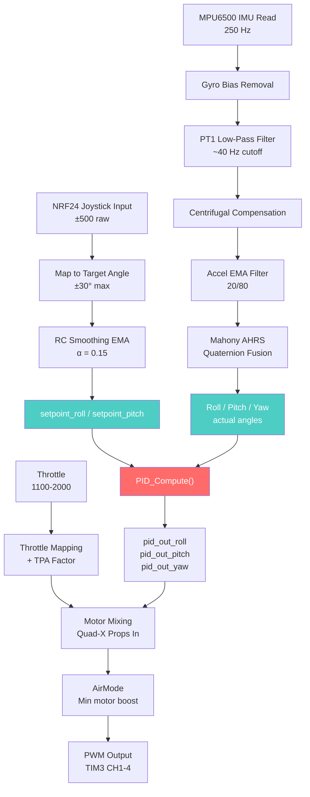

# PID Tuning Guide — STM32H743 Quadcopter

> Complete reference for understanding, tuning, and testing the PID controllers on your custom flight controller.

---

## 1. Your System Specifications

| Component | Detail |
|-----------|--------|
| **MCU** | STM32H743VIT6 (Cortex-M7, 80 MHz) |
| **IMU** | MPU6500 via SPI2 — Gyro 500 dps, Accel ±8g |
| **IMU Hardware Filter** | DLPF at 41 Hz (register 0x1A = 0x03) |
| **IMU Software Filters** | PT1 low-pass ~40 Hz on gyro + EMA (20/80) on accelerometer |
| **AHRS** | Mahony quaternion filter (Kp=1.0, Ki=0.005) |
| **Barometer** | BMP280 via SPI2 — IIR coeff 16, EMA altitude (5/95) |
| **Magnetometer** | Auto-detected QMC5883L / HMC5883L / QMC5883P via I2C1 |
| **Yaw Fusion** | 98% gyro + 2% magnetometer (complementary filter) |
| **PID Loop Rate** | 250 Hz (TIM4 ISR) → dt ≈ 0.004 seconds |
| **Sensor Poll Rate** | 50 Hz (baro + mag, every 5th PID loop) |
| **Motor Output** | PWM via TIM3, range 1100–2000 µs, 4 channels |
| **Motor Idle** | 1150 µs (AirMode keeps motors above this) |
| **Motor Max** | 1940 µs (60 µs headroom below ESC max) |
| **Frame** | Quad-X, Props In configuration |
| **RC Input** | NRF24L01 at 250 kbps, 50 Hz, 8-byte payload |
| **Stick Range** | ±500 raw → mapped to ±30° max tilt angle |
| **RC Smoothing** | EMA α=0.15 on roll/pitch setpoint |
| **Yaw Rate** | Max 90°/sec from joystick |
| **TPA** | Starts at 1500 µs, max 30% P/D reduction at full throttle |

---

## 2. What Are PIDs and What Do They Do?

Your drone has **6 PID controllers**, each controlling a different aspect of flight:

### Attitude PIDs (Run every loop — 250 Hz)

| Controller | Input (Setpoint) | Measurement | Output | Range |
|-----------|-------------------|-------------|--------|-------|
| **pid_roll** | Target roll angle (±30°) | IMU roll angle | Motor differential | ±200 µs |
| **pid_pitch** | Target pitch angle (±30°) | IMU pitch angle | Motor differential | ±200 µs |
| **pid_yaw** | Target heading (0–360°) | IMU yaw angle | Motor differential | ±200 µs |

### Navigation PIDs (Run when mode is active)

| Controller | Input (Setpoint) | Measurement | Output | Range |
|-----------|-------------------|-------------|--------|-------|
| **pid_alt** | Target altitude (m) | BMP280 altitude | Throttle correction | -200 to +300 µs |
| **pid_gps_pitch** | Distance forward to target | 0 (position hold) | Pitch angle override | ±20° |
| **pid_gps_roll** | Distance right to target | 0 (position hold) | Roll angle override | ±20° |

### What P, I, D, and F Do

| Term | What It Does | Too Low | Too High |
|------|-------------|---------|----------|
| **P** (Proportional) | Corrects based on current error | Sluggish, won't level | Fast oscillation, buzzing |
| **I** (Integral) | Corrects accumulated error over time | Drift in wind, can't hold angle | Slow rocking, overshoot |
| **D** (Derivative) | Resists rate of change (damping) | Bouncy, overshoots | Motor noise, hot motors, jitter |
| **F** (Feedforward) | Instant response to stick movement | Stick feels delayed | Overshoot on stick moves |

---

## 3. What Was Changed

### Old Values vs New Values

#### Attitude PIDs

````carousel
**Roll PID**
| Gain | Old Value | New Value | Change |
|------|-----------|-----------|--------|
| P | 0.50 | **1.20** | +140% |
| I | 0.00 | **0.50** | Added |
| D | 0.005 | **0.012** | +140% |
| F | 0.00 | 0.00 | — |
<!-- slide -->
**Pitch PID**
| Gain | Old Value | New Value | Change |
|------|-----------|-----------|--------|
| P | 0.50 | **1.20** | +140% |
| I | 0.00 | **0.50** | Added |
| D | 0.005 | **0.012** | +140% |
| F | 0.00 | 0.00 | — |
<!-- slide -->
**Yaw PID**
| Gain | Old Value | New Value | Change |
|------|-----------|-----------|--------|
| P | 0.50 | **1.00** | +100% |
| I | 0.00 | **0.50** | Added |
| D | 0.005 | **0.000** | Removed |
| F | 0.00 | 0.00 | — |
````

#### Navigation PIDs

| Controller | Gain | Old | New | Change |
|-----------|------|-----|-----|--------|
| **Altitude** | D | 5.0 | **15.0** | +200% |
| **GPS Pitch** | I | 0.0 | **0.01** | Added |
| **GPS Roll** | I | 0.0 | **0.01** | Added |

### Exact Code Changed

File: [main.c lines 151–168](file:///d:/UAV%20Template/UAV%20Template/Core/Src/main.c#L151-L168)

```diff
 // PID Controllers (Attitude)
-PID_Controller pid_roll = {0.5f, 0.0f, 0.005f, 0.0f,   0.0f,
+PID_Controller pid_roll = {1.2f, 0.5f, 0.012f, 0.0f,   0.0f,
                            0.0f, 0.0f, 0.0f,  200.0f, -200.0f};
-PID_Controller pid_pitch = {0.5f, 0.0f, 0.005f, 0.0f,   0.0f,
+PID_Controller pid_pitch = {1.2f, 0.5f, 0.012f, 0.0f,   0.0f,
                             0.0f, 0.0f, 0.0f,  200.0f, -200.0f};
-PID_Controller pid_yaw = {0.5f, 0.0f, 0.005f, 0.0f,   0.0f,
+PID_Controller pid_yaw = {1.0f, 0.5f, 0.000f, 0.0f,   0.0f,
                           0.0f, 0.0f, 0.0f, 200.0f, -200.0f};

 // PID Controllers (Altitude and GPS)
 PID_Controller pid_alt = {
-    50.0f, 10.0f, 5.0f, 0.0f,   0.0f,
+    50.0f, 10.0f, 15.0f, 0.0f,   0.0f,
     0.0f, 0.0f, 0.0f, 300.0f, -200.0f};
 PID_Controller pid_gps_pitch = {
-    0.05f, 0.0f, 0.02f, 0.0f,  0.0f,
+    0.05f, 0.01f, 0.02f, 0.0f,  0.0f,
     0.0f,  0.0f, 0.0f,  20.0f, -20.0f};
 PID_Controller pid_gps_roll = {
-    0.05f, 0.0f, 0.02f, 0.0f,  0.0f,
+    0.05f, 0.01f, 0.02f, 0.0f,  0.0f,
     0.0f,  0.0f, 0.0f,  20.0f, -20.0f};
```

> [!NOTE]
> No logic, functions, or other files were modified. Only 6 numbers were changed across 6 PID struct initializers.

---

## 4. Why the Old Values Were Wrong

### The Math — Roll/Pitch Example

With the **old** values (P=0.5, I=0, D=0.005):

```
Scenario: A wind gust tilts the drone 15° — setpoint is 0°

Error = 15°
P_out = 0.50 × 15° = 7.5 µs
I_out = 0 (no integral term!)
D_out = 0.005 × (gyro rate ~100°/s) ≈ 0.5 µs

Total correction = ~8 µs out of ±200 µs possible
That's only 4% of available authority!
```

With the **new** values (P=1.2, I=0.5, D=0.012):

```
Same scenario: 15° error from wind gust

P_out = 1.2 × 15° = 18 µs (immediate push back)
I_out = 0.5 × (error accumulating) = grows over time until corrected
D_out = 0.012 × 100°/s = 1.2 µs (damps oscillation)

Total correction = ~19 µs immediately, growing with I-term
That's 10% authority and climbing — much more responsive!
```

### Why Each Change Matters

| Change | Problem It Fixes |
|--------|-----------------|
| **P: 0.5 → 1.2** | Drone was barely reacting to tilt. Now it pushes back 2.4× harder. |
| **I: 0 → 0.5** | Without I-term, the drone **cannot** hold a level hover. Any CG offset, motor difference, or wind causes permanent drift. The I-term slowly builds up correction until error reaches zero. |
| **D: 0.005 → 0.012** | Higher P needs higher D to prevent overshoot. D acts like a shock absorber — it resists rapid changes. |
| **Yaw D: 0.005 → 0** | Your yaw measurement comes from gyro + 2% magnetometer correction. Magnetometers are noisy (vibration, motor interference). D amplifies noise, causing yaw jitter. Better to remove it. |
| **Alt D: 5 → 15** | Barometer altitude changes slowly. More D means the drone decelerates earlier when approaching target altitude, preventing overshoot/bounce. |
| **GPS I: 0 → 0.01** | Without I-term in GPS hold, steady wind pushes the drone off position permanently. Small I-term allows it to lean into the wind. |

---

## 5. How Your PID System Works (Control Flow)



### Motor Mixing Formula

```
Motor 1 (Rear Left,  CCW) = throttle + roll - pitch + yaw
Motor 2 (Rear Right, CW)  = throttle - roll - pitch - yaw
Motor 3 (Front Left, CW)  = throttle + roll + pitch - yaw
Motor 4 (Front Right,CCW) = throttle - roll + pitch + yaw
```

### PID Features in Your Code

| Feature | Implementation | File |
|---------|---------------|------|
| D-on-measurement | `-(measured - prev_measured) / dt` | [pid.c:20](file:///d:/UAV%20Template/UAV%20Template/Core/Src/pid.c#L20) |
| D-term EMA filter | `0.3 × new + 0.7 × old` | [pid.c:21](file:///d:/UAV%20Template/UAV%20Template/Core/Src/pid.c#L21) |
| Feedforward | `Kf × (setpoint_change / dt)` | [pid.c:26-27](file:///d:/UAV%20Template/UAV%20Template/Core/Src/pid.c#L26-L27) |
| Dynamic anti-windup | Skips integration when output saturated | [pid.c:30-40](file:///d:/UAV%20Template/UAV%20Template/Core/Src/pid.c#L30-L40) |
| Hard integral clamp | ±400 safety limit | [pid.c:43-45](file:///d:/UAV%20Template/UAV%20Template/Core/Src/pid.c#L43-L45) |
| TPA | Reduces P and D by up to 30% above 1500 µs throttle | [main.c:1026-1038](file:///d:/UAV%20Template/UAV%20Template/Core/Src/main.c#L1026-L1038) |
| Yaw wrap-around | Shortest path ±180° error calculation | [pid.c:67-69](file:///d:/UAV%20Template/UAV%20Template/Core/Src/pid.c#L67-L69) |

---

## 6. Testing Procedure

### Phase 0 — Pre-Flight Checks (No Props)

> [!CAUTION]
> **REMOVE ALL PROPELLERS** for this step.

1. Flash the new firmware to the STM32
2. Power the drone, connect to your web dashboard
3. Verify telemetry shows the new PID values:
   - `pid_r: [1.20, 0.50, 0.01, 0.00]`
   - `pid_p: [1.20, 0.50, 0.01, 0.00]`
   - `pid_y: [1.00, 0.50, 0.00, 0.00]`
4. Arm the drone (throttle at zero + yaw right, or `A,1` from dashboard)
5. Give ~30% throttle
6. Tilt the drone by hand and watch the motors:
   - **Tilt right** → Left motors should spin faster (trying to push left side up)
   - **Tilt forward** → Rear motors should spin faster
   - **Tilt left** → Right motors should spin faster
7. If motors react **opposite** to what's listed above → **STOP. Do not put props on.** Your motor order or mixing is wrong.

### Phase 1 — Bench Test (With Props, Strapped Down)

> [!WARNING]
> **Secure the drone to a heavy surface** with zip ties, clamps, or a test stand. Never hold a drone with spinning props.

1. Mount props (check correct rotation direction!)
2. Strap drone to a heavy board or test stand
3. Arm, give ~35-40% throttle
4. Tilt gently — the drone should actively resist your tilting
5. Watch for:
   - ✅ **Good**: Firm resistance, snaps back to level
   - ❌ **Fast oscillation/buzzing**: P is too high → reduce via dashboard
   - ❌ **Slow rocking back and forth**: I is too high → reduce via dashboard
   - ❌ **No resistance, feels dead**: P is too low → increase via dashboard

### Phase 2 — First Hover (Outdoors, Open Area)

1. Find a large open area (football field, empty parking lot)
2. No wind if possible for first flight
3. Arm and slowly raise throttle until the drone lifts off
4. Hover at ~1 meter height
5. Observe:
   - **Stable hover** → Great, your PIDs are in the ballpark!
   - **Drifts one direction** → I-term will slowly correct this. If it doesn't, I is too low.
   - **Oscillates in roll/pitch** → Land, reduce P by 10-20% via dashboard
   - **Yaw spins slowly** → Yaw I is too low, increase slightly

### Phase 3 — Fine Tuning via Dashboard

Use your web dashboard's PID tuning commands. The format is:

```
P,axis,Kp×100,Ki×100,Kd×100,Kf×100
```

| What You Want | Command to Send |
|--------------|----------------|
| Set Roll P=1.0, I=0.5, D=0.012 | `P,roll,100,50,1,0` |
| Set Pitch P=1.0, I=0.5, D=0.012 | `P,pitch,100,50,1,0` |
| Set Yaw P=0.8, I=0.5, D=0 | `P,yaw,80,50,0,0` |
| Increase Roll P to 1.5 | `P,roll,150,50,1,0` |
| Reduce Roll I to 0.3 | `P,roll,120,30,1,0` |

> [!IMPORTANT]
> The gains are sent as **×100 integers**. So `Kp=1.2` is sent as `120`, `Ki=0.5` as `50`, `Kd=0.012` as `1` (rounded).

### Phase 4 — Save to Flash

Once you're happy with the tuning:

1. **Land and disarm** the drone
2. Send the `B` command from the dashboard (burns PIDs + mag offsets to flash)
3. Power cycle and verify the values persist

---

## 7. Tuning Rules of Thumb

### Tuning Order
```
P first → D second → I third → F last (optional)
```

### Per-Gain Adjustment Guide

| Symptom | Adjust | Direction |
|---------|--------|-----------|
| Drone feels sluggish, slow to respond | **P** | ↑ Increase |
| Fast oscillation (>5 Hz buzzing) | **P** | ↓ Decrease |
| Overshoots and bounces when correcting | **D** | ↑ Increase |
| Hot motors, high-pitched noise | **D** | ↓ Decrease |
| Drone drifts even with sticks centered | **I** | ↑ Increase |
| Slow rocking / bobbing (1-2 Hz) | **I** | ↓ Decrease |
| Stick inputs feel delayed | **F** | ↑ Increase (or increase RC α) |
| Overshoots on fast stick moves | **F** | ↓ Decrease |

### Safe Value Ranges for Your Hardware

| Gain | Roll/Pitch | Yaw | Altitude |
|------|-----------|-----|----------|
| **P** | 0.8 – 2.5 | 0.6 – 2.0 | 30 – 80 |
| **I** | 0.2 – 1.0 | 0.2 – 1.0 | 5 – 20 |
| **D** | 0.005 – 0.025 | 0 – 0.005 | 5 – 40 |
| **F** | 0 – 0.1 | 0 | 0 |

> [!CAUTION]
> **Never exceed these ranges without understanding why.** Values outside these ranges will likely cause dangerous oscillation or loss of control.

---

## 8. Troubleshooting

| Problem | Likely Cause | Fix |
|---------|-------------|-----|
| Drone flips on takeoff | Motor order wrong or props on wrong motors | Check motor mixing matches your wiring |
| Oscillation only at high throttle | TPA not reducing P enough | Reduce `tpa_max_reduction` from 0.3 to 0.15 |
| Yaw twitches randomly | Magnetometer noise feeding yaw D | Keep Yaw D at 0 (already done) |
| Altitude bounces in ALT_HOLD | Alt P too high or D too low | Reduce Alt P to 30-40, increase D to 20-30 |
| Drone drifts in LOITER mode | GPS I too low or poor GPS fix | Increase GPS I to 0.02, ensure ≥8 satellites |
| Drone feels mushy/delayed on sticks | RC smoothing too aggressive | Increase `rc_alpha` from 0.15 to 0.3 in main.c |
| I-term causes slow drift on ground | I-term winding up at low throttle | Already handled — your code resets integrals below 1150 µs |
| PID values reset after power cycle | Forgot to burn to flash | Send `B` command while disarmed |

---

## 9. Advanced: Modifying PID Behaviour

If you need to adjust the PID algorithm itself (not just gains):

| What to Change | Where | Current Value |
|---------------|-------|---------------|
| D-term filter strength | [pid.c:21](file:///d:/UAV%20Template/UAV%20Template/Core/Src/pid.c#L21) | `0.3 new / 0.7 old` — decrease 0.3 for more filtering |
| Integral hard clamp | [pid.c:43](file:///d:/UAV%20Template/UAV%20Template/Core/Src/pid.c#L43) | `±400` — safe limit |
| RC smoothing | [main.c:522](file:///d:/UAV%20Template/UAV%20Template/Core/Src/main.c#L522) | `α = 0.15` — increase for snappier sticks |
| Max tilt angle | [main.c:517-518](file:///d:/UAV%20Template/UAV%20Template/Core/Src/main.c#L517-L518) | `30° / 500 = 0.06°/unit` |
| Max yaw rate | [main.c:527](file:///d:/UAV%20Template/UAV%20Template/Core/Src/main.c#L527) | `90°/sec` |
| TPA breakpoint | [main.c:1028](file:///d:/UAV%20Template/UAV%20Template/Core/Src/main.c#L1028) | `1500 µs` (50% throttle) |
| TPA max reduction | [main.c:1030](file:///d:/UAV%20Template/UAV%20Template/Core/Src/main.c#L1030) | `30%` |
| Mahony AHRS gains | [mahony.h](file:///d:/UAV%20Template/UAV%20Template/Core/Inc/mahony.h) | `Kp=1.0, Ki=0.005` |
| Gyro software LPF | [mpu6500.c:98](file:///d:/UAV%20Template/UAV%20Template/Core/Src/mpu6500.c#L98) | `40 Hz cutoff` |
